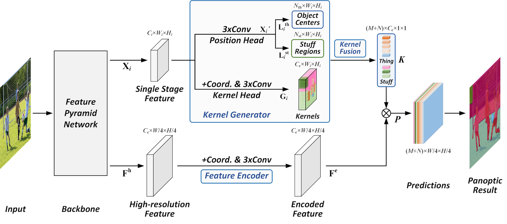

# PanopticFCN
**Fully Convolutional Networks for Panoptic Segmentation**

Yanwei Li, Hengshuang Zhao, Xiaojuan Qi, Liwei Wang, Zeming Li, Jian Sun, Jiaya Jia

[[`arXiv`](https://arxiv.org/pdf/2012.00720.pdf)] [[`BibTeX`](#CitingPanopticFCN)]

<div align="center">
  
</div><br/>


This project provides an implementation for the CVPR 2021 Oral paper "[Fully Convolutional Networks for Panoptic Segmentation](https://arxiv.org/pdf/2012.00720.pdf)" based on [Detectron2](https://github.com/facebookresearch/detectron2). Panoptic FCN is a conceptually simple, strong, and efficient framework for panoptic segmentation, which represents and predicts foreground things and background stuff in a unified fully convolutional pipeline.


## Installation
This project is based on [Detectron2](https://github.com/facebookresearch/detectron2), which can be constructed as follows.
* Install Detectron2 following [the instructions](https://detectron2.readthedocs.io/tutorials/install.html).
* Setup the dataset following [the structure](https://github.com/facebookresearch/detectron2/blob/master/datasets/README.md).
* Copy this project to `/path/to/detectron2/projects/PanopticFCN`

## Training
To train a model with 8 GPUs, run:
```bash
cd /path/to/detectron2
python3 projects/PanopticFCN/train.py --config-file <config.yaml> --num-gpus 8
```

For example, to launch PanopticFCN training (1x schedule) with ResNet-50 backbone on 8 GPUs,
one should execute:
```bash
cd /path/to/detectron2
python3 projects/PanopticFCN/train.py --config-file projects/PanopticFCN/configs/PanopticFCN-R50-1x.yaml --num-gpus 8
```

## Evaluation
To evaluate a pre-trained model with 8 GPUs, run:
```bash
cd /path/to/detectron2
python3 projects/PanopticFCN/train.py --config-file <config.yaml> --num-gpus 8 --eval-only MODEL.WEIGHTS /path/to/model_checkpoint
```

## Results
We provide the results on COCO *val* set with pretrained models. *FPS* is measured on a single V100 GPU.

<table><tbody>
<!-- START TABLE -->
<!-- TABLE HEADER -->
<th valign="bottom">Method</th>
<th valign="bottom">Backbone</th>
<th valign="bottom">Sched</th>
<th valign="bottom">PQ</th>
<th valign="bottom">SQ</th>
<th valign="bottom">RQ</th>
<th valign="bottom">AP</th>
<th valign="bottom">mIoU</th>
<th valign="bottom">FPS</th>
<th valign="bottom">download</th>
<!-- TABLE BODY -->
<tr><td align="left">PanopticFCN</td>
<td align="center">R50</td>
<td align="center">1x</td>
<td align="center"> 41.1 </td>
<td align="center"> 79.8 </td>
<td align="center"> 49.9 </td>
<td align="center"> 32.2 </td>
<td align="center"> 41.5 </td>
<td align="center"> 12.4 </td>
<td align="center"> <a href="https://drive.google.com/file/d/1tD1A5Zwbtri5OejlIz9MLKwzOzjtIMHQ/view?usp=sharing">model</a>&nbsp;|&nbsp;<a href="https://drive.google.com/file/d/1NeUO9EWtkZE0M5NrEpZ8uFqOX3vQg3Lx/view?usp=sharing">metrics</a> </td>
</tr>
<tr><td align="left">PanopticFCN-400</td>
<td align="center">R50</td>
<td align="center">3x</td>
<td align="center"> 41.0 </td>
<td align="center"> 81.0 </td>
<td align="center"> 49.6 </td>
<td align="center"> 30.7 </td>
<td align="center"> 43.6 </td>
<td align="center"> 22.5 </td>
<td align="center"> <a href="https://drive.google.com/file/d/1QBYMAznZDDX7A0Mnaq3euB23rTBzwUCf/view?usp=sharing">model</a>&nbsp;|&nbsp;<a href="https://drive.google.com/file/d/1QOwbA9KRIvDN8PKh10aCQhf1jpykKwbB/view?usp=sharing">metrics</a> </td>
</tr>
<tr><td align="left">PanopticFCN-512</td>
<td align="center">R50</td>
<td align="center">3x</td>
<td align="center"> 42.3 </td>
<td align="center"> 81.1 </td>
<td align="center"> 51.2 </td>
<td align="center"> 32.4 </td>
<td align="center"> 43.2 </td>
<td align="center"> 19.8 </td>
<td align="center"> <a href="https://drive.google.com/file/d/1QBYMAznZDDX7A0Mnaq3euB23rTBzwUCf/view?usp=sharing">model</a>&nbsp;|&nbsp;<a href="https://drive.google.com/file/d/1QOwbA9KRIvDN8PKh10aCQhf1jpykKwbB/view?usp=sharing">metrics</a> </td>
</tr>
<tr><td align="left">PanopticFCN-600</td>
<td align="center">R50</td>
<td align="center">3x</td>
<td align="center"> 42.7 </td>
<td align="center"> 81.2 </td>
<td align="center"> 51.5 </td>
<td align="center"> 33.6 </td>
<td align="center"> 43.9 </td>
<td align="center"> 17.5 </td>
<td align="center"> <a href="https://drive.google.com/file/d/1gIUxy1DJ_V91IwL5_jHQDMOIgHoWn_O1/view?usp=sharing">model</a>&nbsp;|&nbsp;<a href="https://drive.google.com/file/d/1OfbyJWIVfdGQ0C-JNUnXoocHXdILnIkf/view?usp=sharing">metrics</a> </td>
</tr>
<tr><td align="left">PanopticFCN</td>
<td align="center">R50</td>
<td align="center">3x</td>
<td align="center"> 43.6 </td>
<td align="center"> 81.4 </td>
<td align="center"> 52.5 </td>
<td align="center"> 34.4 </td>
<td align="center"> 43.6 </td>
<td align="center"> 12.8 </td>
<td align="center"> <a href="https://drive.google.com/file/d/18Re3keEkIiy7EVS-uFCNPBfT1BfT8Ng3/view?usp=sharing">model</a>&nbsp;|&nbsp;<a href="https://drive.google.com/file/d/1ACrIJ_AZCW3fD7jcipdya3-ixVBojnFO/view?usp=sharing">metrics</a></td>
</tr>
<tr><td align="left">PanopticFCN*</td>
<td align="center">R50</td>
<td align="center">3x</td>
<td align="center"> 44.2 </td>
<td align="center"> 81.7 </td>
<td align="center"> 52.9 </td>
<td align="center"> 35.6 </td>
<td align="center"> 43.9 </td>
<td align="center"> 9.3 </td>
<td align="center"> <a href="https://drive.google.com/file/d/1_VkJIhbQg9uqN49L3cDAW66zZKJE0fkI/view?usp=sharing">model</a>&nbsp;|&nbsp;<a href="https://drive.google.com/file/d/1uulb8PATBy1dF2VhlgQYQlo7gEdKRMK1/view?usp=sharing">metrics</a></td>
</tr>
</tbody></table>

A faster version is also provided with higher threshold but similar PQ results, which shares the same model with the corresponding normal one. This version could be suitable for you if the final panoptic results are taken into consideration only.

<table><tbody>
<!-- START TABLE -->
<!-- TABLE HEADER -->
<th valign="bottom">Method</th>
<th valign="bottom">Backbone</th>
<th valign="bottom">Sched</th>
<th valign="bottom">PQ</th>
<th valign="bottom">SQ</th>
<th valign="bottom">RQ</th>
<th valign="bottom">AP</th>
<th valign="bottom">mIoU</th>
<th valign="bottom">FPS</th>
<th valign="bottom">download</th>
<!-- TABLE BODY -->
<tr><td align="left">PanopticFCN</td>
<td align="center">R50</td>
<td align="center">1x</td>
<td align="center"> 41.1 </td>
<td align="center"> 79.8 </td>
<td align="center"> 49.9 </td>
<td align="center"> 30.2 </td>
<td align="center"> 41.4 </td>
<td align="center"> 13.6 </td>
<td align="center"> <a href="https://drive.google.com/file/d/1tD1A5Zwbtri5OejlIz9MLKwzOzjtIMHQ/view?usp=sharing">model</a>&nbsp;|&nbsp;<a href="https://drive.google.com/file/d/1NeUO9EWtkZE0M5NrEpZ8uFqOX3vQg3Lx/view?usp=sharing">metrics</a> </td>
</tr>
<tr><td align="left">PanopticFCN-400</td>
<td align="center">R50</td>
<td align="center">3x</td>
<td align="center"> 40.8 </td>
<td align="center"> 81.1 </td>
<td align="center"> 49.4 </td>
<td align="center"> 28.9 </td>
<td align="center"> 43.5 </td>
<td align="center"> 26.1 </td>
<td align="center"> <a href="https://drive.google.com/file/d/1QBYMAznZDDX7A0Mnaq3euB23rTBzwUCf/view?usp=sharing">model</a>&nbsp;|&nbsp;<a href="https://drive.google.com/file/d/1QOwbA9KRIvDN8PKh10aCQhf1jpykKwbB/view?usp=sharing">metrics</a> </td>
</tr>
<tr><td align="left">PanopticFCN-512</td>
<td align="center">R50</td>
<td align="center">3x</td>
<td align="center"> 42.3 </td>
<td align="center"> 81.1 </td>
<td align="center"> 51.2 </td>
<td align="center"> 30.7 </td>
<td align="center"> 43.2 </td>
<td align="center"> 22.0 </td>
<td align="center"> <a href="https://drive.google.com/file/d/1QBYMAznZDDX7A0Mnaq3euB23rTBzwUCf/view?usp=sharing">model</a>&nbsp;|&nbsp;<a href="https://drive.google.com/file/d/1QOwbA9KRIvDN8PKh10aCQhf1jpykKwbB/view?usp=sharing">metrics</a> </td>
</tr>
<tr><td align="left">PanopticFCN-600</td>
<td align="center">R50</td>
<td align="center">3x</td>
<td align="center"> 42.7 </td>
<td align="center"> 80.8 </td>
<td align="center"> 51.4 </td>
<td align="center"> 31.6 </td>
<td align="center"> 43.9 </td>
<td align="center"> 19.1 </td>
<td align="center"> <a href="https://drive.google.com/file/d/1gIUxy1DJ_V91IwL5_jHQDMOIgHoWn_O1/view?usp=sharing">model</a>&nbsp;|&nbsp;<a href="https://drive.google.com/file/d/1OfbyJWIVfdGQ0C-JNUnXoocHXdILnIkf/view?usp=sharing">metrics</a> </td>
</tr>
<tr><td align="left">PanopticFCN</td>
<td align="center">R50</td>
<td align="center">3x</td>
<td align="center"> 43.6 </td>
<td align="center"> 81.4 </td>
<td align="center"> 52.5 </td>
<td align="center"> 32.4 </td>
<td align="center"> 43.6 </td>
<td align="center"> 13.5 </td>
<td align="center"> <a href="https://drive.google.com/file/d/18Re3keEkIiy7EVS-uFCNPBfT1BfT8Ng3/view?usp=sharing">model</a>&nbsp;|&nbsp;<a href="https://drive.google.com/file/d/1ACrIJ_AZCW3fD7jcipdya3-ixVBojnFO/view?usp=sharing">metrics</a> </td>
</tr>
<tr><td align="left">PanopticFCN*</td>
<td align="center">R50</td>
<td align="center">3x</td>
<td align="center"> 44.2 </td>
<td align="center"> 81.7 </td>
<td align="center"> 52.9 </td>
<td align="center"> 33.4 </td>
<td align="center"> 43.9 </td>
<td align="center"> 9.7 </td>
<td align="center"> <a href="https://drive.google.com/file/d/1_VkJIhbQg9uqN49L3cDAW66zZKJE0fkI/view?usp=sharing">model</a>&nbsp;|&nbsp;<a href="https://drive.google.com/file/d/1uulb8PATBy1dF2VhlgQYQlo7gEdKRMK1/view?usp=sharing">metrics</a> </td>
</tr>
</tbody></table>

## <a name="CitingPanopticFCN"></a>Citing PanopticFCN

Consider cite PanopticFCN in your publications if it helps your research.

```
@inproceedings{li2021panopticfcn,
  title={Fully Convolutional Networks for Panoptic Segmentation},
  author={Yanwei Li, Hengshuang Zhao, Xiaojuan Qi, Liwei Wang, Zeming Li, Jian Sun, and Jiaya Jia},
  booktitle={IEEE Conference on Computer Vision and Pattern Recognition (CVPR)},
  year={2021}
}
```
Consider cite this project in your publications if it helps your research. 
```
@misc{PanopticFCN,
    author = {Yanwei Li},
    title = {PanopticFCN},
    howpublished = {\url{https://github.com/yanwei-li/PanopticFCN}},
    year ={2021}
}
```
